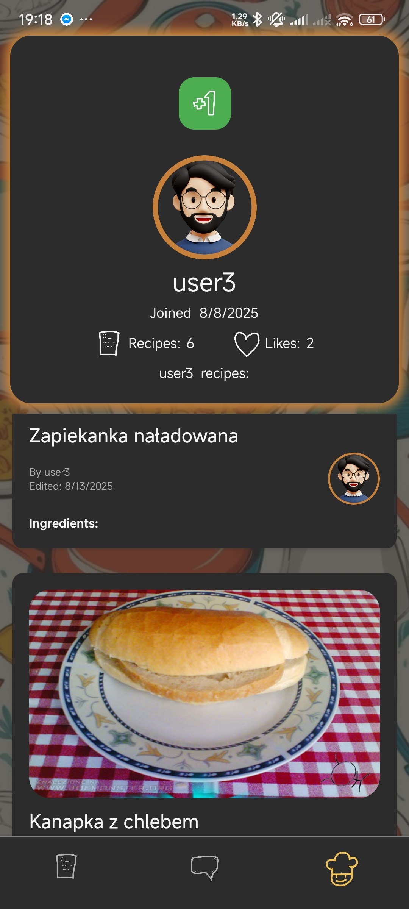

# AT-App

Mobile application that allows users to share their recipes with each other.

## 🚀 Features
- User authentication (login / logout)
- Browsing recipes and user profiles
- Adding, editing, and removing owned recipes
- Upvote system for recipes and users
- Comments under recipes
- Application preferences stored in database:
  - Profile picture
  - Language selection
  - Theme selection
- Cloudinary (image storage)
- Custom backend API for media handling
- Application remembers logged-in user on device
- Random recipe selection

## 🛠️ Tech Stack
- React Native
- Expo
- TypeScript
- REST API
- Expo Router / React Navigation
- Firebase Authentication
- Firebase Firestore

## 🏗️ Architecture Overview
- Application uses Firebase Authentication for user management.
- Firestore is used as the main database for application data.
- Images are stored in Cloudinary to reduce Firebase storage costs.
- A custom backend API handles communication between the mobile app and Cloudinary.
- Firestore stores only image URLs returned from Cloudinary.

## 📸 Screenshots




---

# How to run application 👋

This is an [Expo](https://expo.dev) project created with [`create-expo-app`](https://www.npmjs.com/package/create-expo-app).

## Get started

1. Install dependencies

   ```bash
   npm install
   ```

2. Start the app

   ```bash
   npx expo start
   ```

# You can run the app on:
- Android emulator
- iOS simulator
- Expo Go
